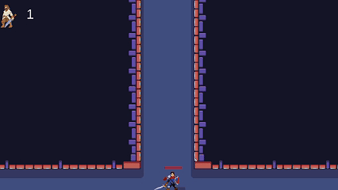

# My-Platformer-Game
Платформер на Unity, который был написан для сдачи предмета по программированию

# Запуск
Тестовый билд можно запустить из папки Build2

Управление: A, D - перемещение Влево и Вправо, ЛКМ - атака, ПКМ - блок
Чтобы пройти уровень надо победить всех врагов, на последнем уровне босс

Выхода нет, только ALT F4 или пройти игру

# Спойлер

